<div align="center">



<br />

<a href="https://github.com/Ankeryjh">
  
</a>

<br />

<sub>人工智能 · 智能体 · 编程 · 自动化</sub>

</div>

---

```text
┌─ ANKER / AI LAB ──────────────────────────┐
│ 系统状态   ● 持续构建中                    │
│ 当前角色   AI AGENT 工程师                 │
│ 技术方向   LLM / AGENT / 全栈开发          │
│ 当前聚焦   PYDANTICAI / 上下文工程          │
└───────────────────────────────────────────┘
```

## 01 / 关于我

我是 **Anker**。我的技术起点是前端工程和数字媒体技术，长期使用 Vue、React 和 TypeScript 构建真实可交互的产品。现在，我正在从 **Frontend Engineer** 走向 **AI Agent Engineer**，尝试把大语言模型变成能够检索知识、调用工具、理解上下文并自动完成任务的系统。

我更关注真正可落地、可观察、可验证的 AI 系统：数据从哪里来、模型为什么这样回答、工具执行了什么、失败后如何恢复，以及最终结果能否被检查。相比只有一个聊天框的演示，我更希望构建能够进入真实业务流程的智能体。

在编程之外，我也热爱健身。稳定的身体，是持续创造和长期学习的底层硬件。

> 从“构建人们可以使用的界面”，走向“构建能够理解、决策并行动的智能系统”。

---

## 02 / AI 技术栈

<sub>技术矩阵 / 系统能力</sub>

<div align="center">
  
</div>

<br />

<table>
  <tr>
    <td><strong>AI / AGENT</strong></td>
    <td><code>PydanticAI</code> <code>LangGraph</code> <code>LangChain</code> <code>RAG</code> <code>MCP</code> <code>Tool Calling</code></td>
  </tr>
  <tr>
    <td><strong>模型生态</strong></td>
    <td><code>OpenAI</code> <code>Claude</code> <code>Gemini</code> <code>Qwen</code> <code>DeepSeek</code></td>
  </tr>
  <tr>
    <td><strong>前端开发</strong></td>
    <td><code>Vue</code> <code>React</code> <code>TypeScript</code> <code>JavaScript</code> <code>Element UI</code> <code>ECharts</code></td>
  </tr>
  <tr>
    <td><strong>后端开发</strong></td>
    <td><code>Node.js</code> <code>Express</code> <code>Spring Boot</code> <code>MySQL</code> <code>Redis</code></td>
  </tr>
  <tr>
    <td><strong>工程部署</strong></td>
    <td><code>Docker</code> <code>Linux</code> <code>Nginx</code> <code>Git</code></td>
  </tr>
</table>

```text
用户问题 ──► 知识检索 ──► 上下文构建 ──► 模型推理 ──► 工具执行 ──► 可验证结果
                │              │              │
             QDRANT        SESSION MEMORY   GUARDRAILS
```

---

## 03 / 我正在构建

<sub>当前实验 / 可落地智能体系统</sub>

### 🧠 本地 AI 学习系统

从普通模型聊天开始，逐步搭建完整的本地 AI 应用链路：**Ollama → Embedding → Qdrant → RAG → Query Rewrite → Tool Calling → Agent Harness → Session Memory → Web Agent → 执行轨迹 → Guardrails**。

它不仅用来展示最终答案，也会把 Chunk、向量检索、Top-K、上下文、工具调用和执行结果完整展示出来，让 Agent 的运行过程真正可观察。

### 🏢 企业决策智能体

使用 **PydanticAI** 连接企业私有知识库与经过权限控制的业务数据工具，为企业提供有证据来源的规划建议、辅助决策和风险预警。重要结果必须保留引用、数据依据和人工复核入口，而不是让模型直接替企业做决定。

### ⚙️ 可控制的 Agent Runtime

构建具有类型化工具契约、Session 隔离、同 Session 并发锁、最大执行轮数、结构化错误回传、工具白名单与完整执行轨迹的 Agent Runtime。目标不是制造一个不可解释的黑盒聊天机器人，而是构建可靠的自动化系统。

---

## 04 / 项目作品

<sub>真实项目 / 开放源码</sub>

### 01 — [Local AI Learning](https://github.com/Ankeryjh/local-ai-learning)

从零学习和实现 Ollama、Embedding、Qdrant、RAG、Agent Harness 与 SQLite Session Memory 的端到端 AI 工程项目。

`LLM` · `RAG` · `Qdrant` · `Agent` · `Python`

### 02 — [AI Fitness](https://github.com/Ankeryjh/AI-Fitness)

融合组间歇计时与 AI 智能陪练体验的健身应用，探索 AI 能力如何进入具体产品场景。

`AI 产品` · `TypeScript` · `前端开发`

### 03 — [Prompt Optimization](https://github.com/Ankeryjh/prompt-optimization)

选中文本后即可调用 AI 进行提示词优化的轻量工具，让模糊想法更快变成清晰、有效的 Prompt。

`AI 工具` · `JavaScript` · `提示词工程`

### 04 — [Mathcity](https://github.com/Ankeryjh/Mathcity)

结合 Vue、ECharts、Node.js 与 MySQL 的智慧城市数据可视化系统，重点呈现复杂数据的交互与表达。

`Vue` · `ECharts` · `Node.js` · `MySQL`

---

## 05 / 当前聚焦

<sub>系统状态 / 持续学习中</sub>

<div align="center">
  
</div>

```text
[进行中]  PydanticAI 与类型化 Agent 架构
[进行中]  Context Engineering 与长会话管理
[构建中]  企业 RAG 与辅助决策工作流
[验证中]  Agent 评测、可观察性与安全护栏
[学习中]  MCP 生态与可靠的工具执行机制
```

我的方向很明确：构建能够理解企业上下文、安全使用工具、说明证据来源，并且不局限于单轮聊天的 AI 系统。

---

## 06 / GITHUB 动态

<sub>代码记录 / 持续构建 / 开源实践</sub>

<div align="center">
  
  <br />
  
  <br />
  
  <br />
  
</div>

---

<div align="center">

### 设计界面 · 构建智能体 · 自动化真实工作流

<sub>保持好奇，构建有用的系统，并验证每一次输出。</sub>

<br /><br />


</div>
